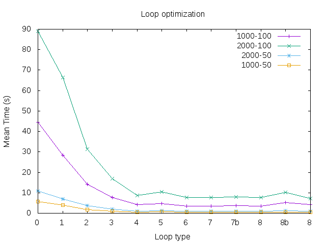

# Loop optimization

In this report we analize various techniques to improve the time performances of a loop
execution in a program. In particular we focus our attention to a 4 times nested loop of
a C program that deals with a set of `Np` particle imagined inside a 3-dimensional grid of size `Ng`.
The naive implementation of the loop (labeled by 0) is the following:

```
for(p = 0; p < Np; p++)
  for(i = 0; i < Ng; i++)
    for(j = 0; j < Ng; j++)
      for(k = 0; k < Ng; k++){
	    dist = sqrt( pow(x[p] - (double)i/Ng + half_size, 2) +
			 pow(y[p] - (double)j/Ng + half_size, 2) +
			 pow(z[p]  - (double)k/Ng + half_size, 2) );
	    if(dist < Rmax)
	      dummy += dist;
      }

```

We will improve this cycle step by step, measuring each time his performance to better understand
what corrections lead to the best improvements. The times reported in the figure at the bottom are means over 10
executions. The labels referring to the optimization steps are the same used in the graph at the bottom.


1) First of all, we eliminate the sqrt() function from the code. This function is very computational intensive and
in this particular situation is uncesessary, since we can obtain the same result comparing the squares of `dist` and `Rmax`.
As we can see this improves a lot the performance of the loop, before the square root has to be computed at each time 
of each cycle for a total of `Ng*Ng*Ng*Np` times.

 
2) In the second step we get rid also of the `pow()` function, which in this case can be replaced by a simpler and faster 
multiplication. So the code inside the loops is now

```
double dx, dy, dz;
dx = x[p] - (double)i/Ng + half_size;
dy = ...
dz = ...

dist = dx*dx + dy*dy + dz*dz;
```


3) Since the floating point multiplication is faster then division we introduce a new variable
`double Ng_inv = (double)1.0 / Ng`
and rewrite the previous code as `dx = x[p] - (double)i * Ng_inv + half_size;` for all the three dimensions.


4) Now we observe that the variable `dx` depends only on the `i` of the outer loop over the grid, and that
also `dy` depends on the `j` of the second grid loop. This means that these values can be computed only once for all the 
loops that are inside. So we calculate them, and their squares, outside the loops.
Also the sum of `dx` square and `dy` square can be computed only once outside the innermost loop. The code is now

```
for(p = 0; p < Np; p++)
	for(i = 0; i < Ng; i++){
		double dx2 = x[p] - (double)i * Ng_inv + half_size; dx2 = dx2*dx2;
      
		for(j = 0; j < Ng; j++){
	    		double dy = y[p] - (double)j * Ng_inv + half_size;
	    		double dist2_xy = dx2 + dy*dy;
	    
	    		for(k = 0; k < Ng; k++){
				double dz;
				dz = z[p] - (double)k * Ng_inv + half_size;
				dist = dist2_xy + dz*dz;
				if(dist < Rmax2)
		  		dummy += sqrt(dist);
			}
		}
	}
```


5) The code is the same as 4 but now the sum and multiplication for dist2_xy are in separated lines.
```
dy2 = dy2*dy2; 
double dist2_xy = dx2 + dy2;
```
The code runs slower than the previous version because now the CPU now cannot perform the two operations in
only one cycle as did before.


6) Here we add the `register` directive to the most used variables, like `half_size, Ng_inv` and of course
`dx, dy, dz` in the hope that this will force the compiler to write a code where these variables stay in the CPU
register as much as possible.


7) Inside each grid cycle we need a value of the type `(double)i * Ng_inv + half_size;` so to avoid multiple
calculations of these values we compute them once at the beginning and store them in a vector:


```
double *jks = (double*)calloc(Ng, sizeof(double));

for(i = 0; i < Ng; i++)
    jks[i] = (double)i * Ng_inv + half_size;
```

Furthermore we decide to change the configuration of the vector with particles coordinates. Before we used
contiguous memory separately for the x, y and z coordinates, now we want all the three coordinates of a particle 
to be close together since they are used in consecutive computations.


7b) The order of the loops is reversed, in the sense that now we start from the last element and go on
untill 0. This is because checking if a value is zero requires less CPU instructions than a comparison with
a non zero value. The benefits are minimal in this case.


8) The two vectors, the one for the particles and jks, are now allocated using the `posix_memalign` function that allow
us to specify the alignment of memory.

`posix_memalign((void**)&parts, 16, Np * 3 * sizeof(double));`
`posix_memalign((void**)&jks, 16, Ng * sizeof(double));`

We also try to vectorize the innermost loop, the `k` one.
To do this we assume that the grid size is a multiple of 4 and introduce a vector of 4 double to contain the
distances along the z axis `dz` and the total distance.
```
#pragma ivdep    	    
	      for(k = 0; k < Ng; k+=4){
		  double dz2[4] = {(parts[p+2] - jks[k]),
		  		 (parts[p+2] - jks[k+1]),
		  		 (parts[p+2] - jks[k+2]),
		  		 (parts[p+2] - jks[k+3]) };
		  
		  double dist2[4] = {dist2_xy + dz2[0]*dz2[0],
		  		   dist2_xy + dz2[1]*dz2[1],
		  		   dist2_xy + dz2[2]*dz2[2],
		  		   dist2_xy + dz2[3]*dz2[3]};

		  int register c;
#pragma ivdep		
		  for(c = 0; c < 4; c++)
		    if( dist2[c] < Rmax2 )
		      dummy += sqrt(dist2[c]);

		}
```


The use of the `#pragma ivdep` hints the compiler to ignore vector dependencies for this loop and helps the vectorization.


8b) Here we tried to vectorize all the loops, introducing more vectors like done in the previous case. But the 
performances seem to be worst in this case.


8pref) We restart from the code of 8\) and try to force the prefetching of the particle
coordinates vector. We add the instructions
```
if(p % 8 == 0){
  __builtin_prefetch ( &parts[p], 0, 1);
  __builtin_prefetch ( &parts[p+1], 0, 1);
  __builtin_prefetch ( &parts[p+2], 0, 1);
 }

```
just at the beginning of the particles loop (the `p` one). 
By doing this we improve a little bit the performances.


