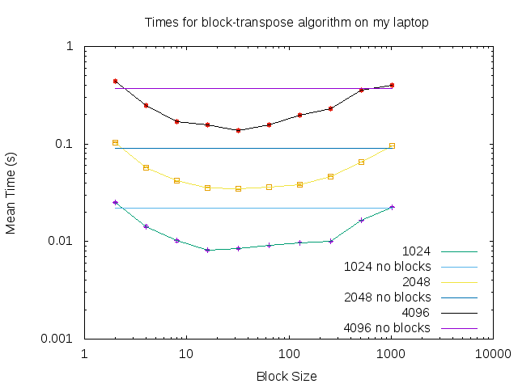
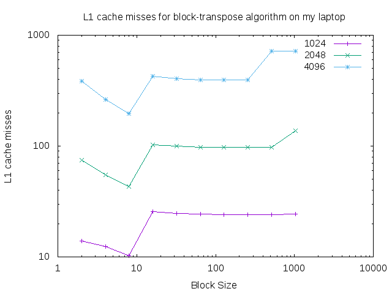

# Matrix Transpose Block Algorithm

In this report we compare the performance of two implementations of the matrix
transpose algorithm. The first is the naive one, where the matrix is transposed
one row at the time. In the second algorithm instead the whole matrix is divided into
smaller blocks, and the algoritm proceeds transposing one block at the time.
The two transposing cycles are shown below:
```
for( i = 0; i < MATRIXDIM; i++ )
	for( j = 0; j < MATRIXDIM; j++ )
		*(AT + MATRIXDIM*i + j ) = *(A + MATRIXDIM*j + i );
```
```
for( ib = 0; ib < n_blocks; ib++ ){

	ioff = ib*bsize;
	
	for( jb = 0; jb < n_blocks; jb++ ){

		joff = jb*bsize;

		for( i = 0; i < bsize; i++ )
			for( j = 0; j < bsize; j++ )
				*(AT + MATRIXDIM*(i + ioff) + j + joff) = *(A + (j+joff)*MATRIXDIM + (i+ioff) );
	} // jb
} // ib
```

The idea is that if the block is small enough to fit in the L1 cache memory than
the execution of the second implementation should be faster than the first one.
Every time an element stored in the main memory, for example a `double`, is required by the
CPU an entire block of memory, called cache line, is transfered into the cache memory. To
fully take advantage of the speed of this kind of memory is better to use all the values stored
in this line. This is exactly what
the second implementation aims to do. If the size of the block we transpose perfectly fits into
the cache then the number of so called cache misses will be as low as possible, instead, if the
block doesn't fit the cache line, the execution will require a higher number of useless memory
transfers.
In the folder `/sys/devices/system/cpu/cpu0/cache` one can find useful informations about the cache. 
For example on my laptop the
L1 cache has size 32K, and the line size is 64 Bytes. Since the matrices used in the program are made
of doubles, and the size of a double is 8 bytes, the perfect block size should be 8.
In the figure below we can see the mean time of the execution of the algorithm, using different
block sizes chosen such that they perfectly divide the matrix size.
I used three different matrix sizes: 1024, 2048 and 4096. The means are taken on 20 repetitions.



As expected the time execution has a convex trend, and the curve obtained reach a minimum for
a block size between 16 and 64. Unfortunatly this is not the value expected by the previous calculation, it's
a little bit too high, but the performance of the block of size 8 are still pretty good.
To explain what happens we can use the `perf` tool to supervise the L1 cache activity. The graph
below shows the L1-dcache load misses for the execution of the algorithm. As we can see for the
calculated perfect block size the L1 misses are the lowest ones for all the three matrices.
Probably the faster execution associated to the different block sizes are simply due to the L2 cache activity.




