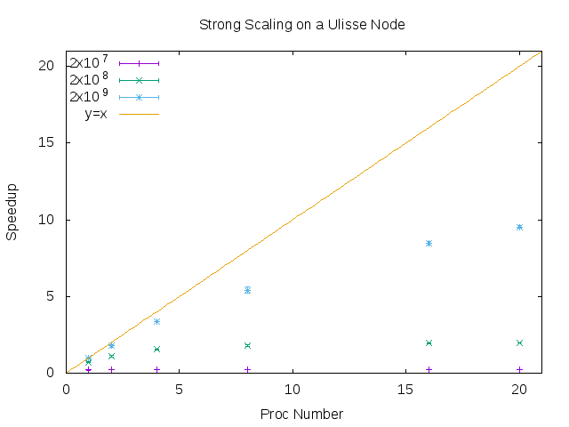
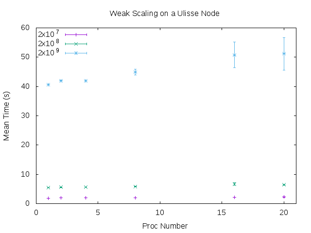

# Strong and Weak Scalability on a Ulisse's Node

In this report we analize the weak and strong scalability of a simple program
that calculates the mathematical constant PI using a Monte Carlo method, on
one of the nodes of the Ulisse cluster.
A Ulisse's node is composed by two Intel CPUs with ten cores each, for this
reason we measured the scaling of the program up to twenty processes.

For the measure of the wall time of the execution we used the `time` utility of the shell.

In the strong scaling setting we increase the number of processes
keeping the size of the problem constant. So we espect the execution to be
faster as we add more processes to the computation. In particular, in an ideal
setting, if we double the number of processors the execution time should decrease
by a factor of two.
To catch the behaviour of the program we will use the so called _speedup_, defined as the
ratio between the execution time of the serial version of the code and the parallelized one.
The perfect scaling mentioned above is depicted by a linear growth of this quantity.
The average time for the serials versions are reported in the table, averages are taken from
5 runs of the program, for 2x10^7^, 2x10^8^ and 2x10^9^ points.

| Points | Mean Time |
|--------|----------:|
| 2x10^7 |     0.39  |
| 2x10^8 |     3.93  |
| 2x10^9 |    39.22  |

The figure below shows the speedup of the parallelized version for 1,2,4,8,16 and 20
processes. As we can see the behaviour is far from optimality, in particular when then
number of points is low (for example 2x10^7). In this case the overhead introduced by
processes communication is so high compared to the real calculations that there are no benefits
for the performances.
But when we increase the number of points things are better and the speedup keeps growing
as we add more processes. Nonetheless for 20 processes the execution is not even 10 times
faster then the serial version, showing that communication overhead still plays a central role.

In the weak scaling, instead, the size of the problem increases together with
the number of processes, so that the final computational effort at the end is
much bigger than that at the beginning. But since we distribute the payload to all
the processes we expect the time to be the same for all the executions and also
to be the same of the serial version.
In the graph below we can see the timings and the relative errors for the three different
points number. The situation here is the opposite of the strong scaling setting: for small
problems the time seems to be constant but for the bigger ones the higher the number of processes
the more the times are different and increase together with the number of processes.

