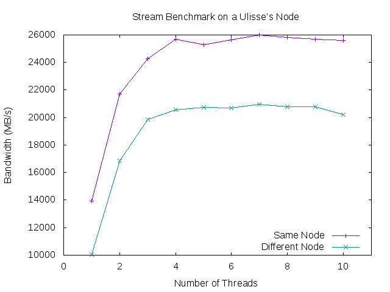

# Stream Benchmark on a Ulisse's Node

The stream benchmark refers to a program that estimates the communication
Bandwidth from main memory to a processor.
In this experience we will measure
this quantity on a Ulisse's node in four different scenarios that summarize
the possible situations on a NUMA architecture.
To deal with this we're going to use the `numactl` tool that allows
the user to analize and control NUMA nodes.
The command `numactl --hardware`, for example, gives some simple informations about the
architecture, for example in our case the output

```
available: 2 nodes (0-1)
node 0 cpus: 0 1 2 3 4 5 6 7 8 9
node 0 size: 20451 MB
node 0 free: 19522 MB
node 1 cpus: 10 11 12 13 14 15 16 17 18 19
node 1 size: 20480 MB
node 1 free: 19583 MB
node distances:
node   0   1 
  0:  10  11 
  1:  11  10 

```

tells us that we have 2 CPUs (here called nodes) with 10 cores each (called cpus) and
that each CPU has its own main memory. The last matrix provides a rough measure of the
distance between each CPU.

In the first part we will measure the bandwidth from a CPU to the memory in two cases:
when the memory is the one assigned to that CPU and when the memory is in the other
socket. To do this we will use again `numactl` with options `--cpunodebind` and
`--membind` that allow us to bind the execution of a program respectively to the
specified CPU or memory.

Using `numactl --cpunodebind 0 --membind 0` we obtain the output

13602.4 +/- 4.3 MB/s


(values are the mean of three run) while with `numactl --cpunodebind 0 --membind 1` we get

13929.0 +/- 13.2 MB/s

As expected when the memory used is not the one attached to the processor the bandwidth
is lower.

Now we will use the OpenMP version of stream to measure the bandwidth when many threads
are trying to access the memory at the same time. This test will again be performed in two
cases: same memory and different memory. Since a CPU has 10 cores we will use a maximum of
10 threads. Results are shown in the table below

| threads | Same Socket | Other Socket |
|--------:|------------:|-------------:|
|        1|      13950.0|       10027.5|
|        2|      21730.8|       16853.5|
|        3|      24291.5|       19864.0|
|        4|      25706.3|       20565.1|
|        5|      25297.1|       20760.8|
|        6|      25650.3|       20709.9|
|        7|      25989.2|       20947.8|
|        8|      25824.8|       20790.3|
|        9|      25671.2|       20764.6|
|       10|      25615.4|       20190.8|


As we can see, with the help of the graph at the bottom, when the number of threads increases
also the total bandwidth increases but when too many threads are using the network the bandwidth
reaches the peak and stabilizes itself there.



